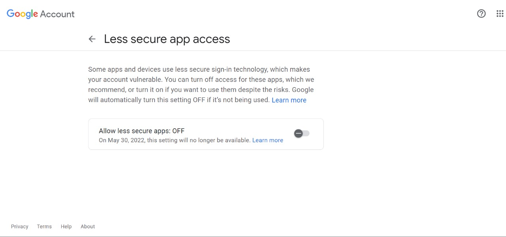
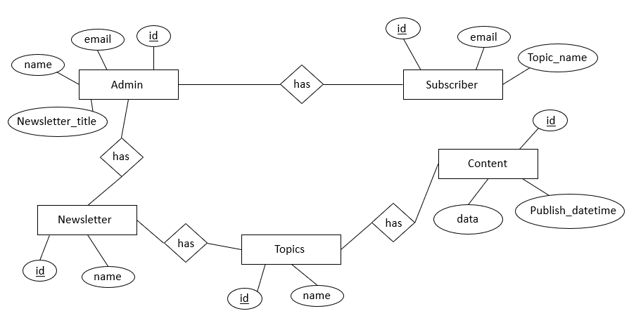

# Newsletter Service

Newsletter 

# Inference from Problem Statement

* Create a Newsletter Service
* Admin should be able to create Newsletters
* One Newsletter has at least one topic
* Each topic has multiple articles(content)
* User/Client should be able to subscribe to a **_specific topic_** of a particular Newsletter
* Every article(content) will be associated with only one topic
* Articles have Publish Time and Data :
  * **Publish_Time:** Date and time at which Article will be sent to the subscriber 
  * **Data:** Content of the Article
* Subscriber receives an email at the time scheduled by the Admin (publish_time specified in content) 

# Design of the Database




# API Endpoints

## API Calls should be made in the following order

## POST /register

* **admin_name:** Name of the Admin (Owner of Newsletter)
* **email:** Email ID of the Admin 
* **title:** Title of the Newsletter

```
{
	"admin_name":"admin1",
	"email":"admin1@email.com",
	"title":"newsletter1"
}
```


## POST /add-topics
* **email:** Email ID of the Admin (Owner of Newsletter) to which topics are to be added
* **name: **Name of the Topic

```
{
	"email":"admin1@email.com",
	"name":"blockchain"
}
```


## POST /add-content

* **publish_time:** Schedule time (format : "YYYY,MM,DD,hh,mm,ss")
* **content_data:** Data to be sent
* **topic_id:** Integer referenced in TOPICS table of database
* **email:** EMail Id of the admin corresponding to Newsletter 

```
{
    "publish_time":"2022,04,06,08,45,00",
    "content_data":"article 1 content: Blockchain",
    "topic_id":2,
    "email":"admin1@email.com"
}
```


## POST /:newsletter/subscribe

* **sub_email:** Subscriber email 
* **topic:** Topic of subscription

```
{
	"sub_email":"mirid38454@abincol.com",
	"topic":"blockchain"
}
```

# Results

* Admin can register
* Admin can add multiple topics 
  * Duplicate topics are not allowed 
* Admin can add content to each topic and schedule the time at which this content can be sent to its subscribers
* Client/User can subscribe to a specific topic and become a subscriber as a result receive content from different Newsletters

# Shortcomings

* Each Admin can create only one Newsletter
* Subscriber cannot unsubscribe 
* Client can receive articles from different Newsletter based on topic

# Future Work

* Authentication and Authorization of Admin using JWT (JSON Web Tokens)
* Each Admin can have multiple Newsletters
* Subscriber can unsubscribe from the Newsletter Service
* Rate Limiting API calls
* Implementing below schema



# References

* [Node.js](https://nodejs.org/en/docs/)
* [Express.js](https://expressjs.com/en/5x/api.html)
* [nodemailer](https://nodemailer.com/about/)
* [node-schedule](https://www.npmjs.com/package/node-schedule)
* [sqlite3](https://www.sqlite.org/lang.html)
* [DB Browser](https://sqlitebrowser.org/)
* [Postman](https://learning.postman.com/docs/getting-started/introduction/)


